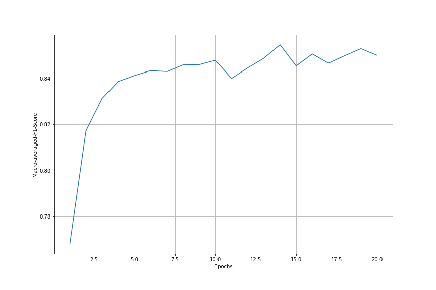
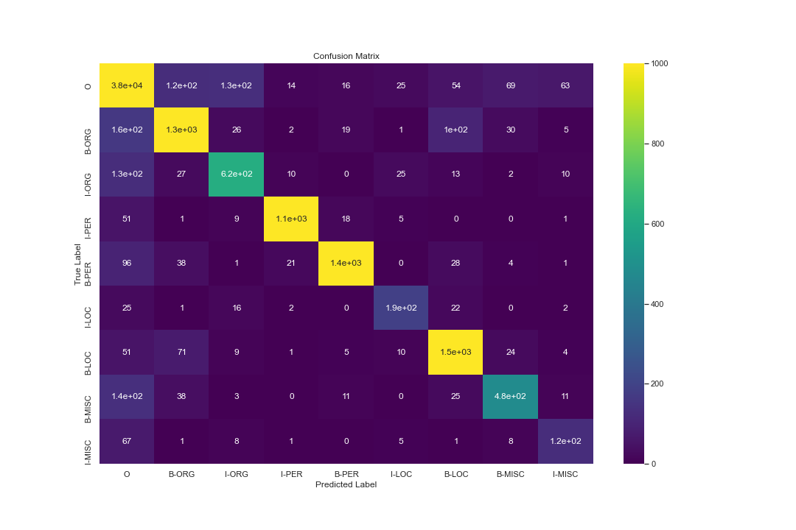

# Sequence Tagger

## Task Description
Task is to implement a simple sequence tagger using word embeddings for named entity recognition. Model Architecture is a bidirectional LSTM with a single 100-dimenstional hidden layer. The word embeddings are pretrained which has the dimension of 50. Macro-averaged F1-Score is the evaluation that has been used to evaluate the performance of the model. The dataset is highly dominated a single label, so accuracy is not an appropriate metric for evaluation.

<b>Hyperparameters:</b> 
Loss Function: Cross-Entropy Loss 
Batch-size: 1 
Training Cycles: 20 
Optimizer: ADAM 
Learning rate: 0.001 
Embedding Dimension: 50 

## Performance of Model on Validation set
Macro-Averaged F1-Score was used to measure the performance of the model on validation set for every epochs. 

## Performance of Model of Test Set

Micro-averaged F1-Score: 0.818995

Performance of the model can also be measured using the confusion matrix which gives the overview of true positive, true negative, false postive and false negative counts.

